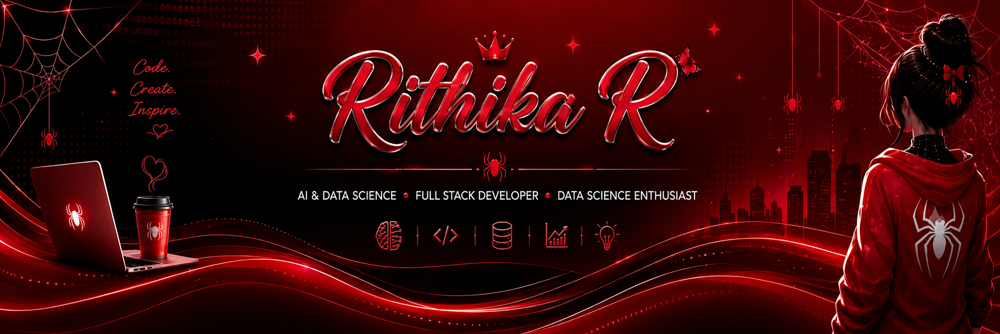

<h1 align="center">
  Hey there, I'm Rithika 👋
</h1>

  

 

<h2 align="center">👩‍💻 About Me</h2>

<table align="center">
<tr>

<td width="65%" valign="top">

- 🎓 3rd Year B.Tech Artificial Intelligence & Data Science student.
- 💻 Data Science enthusiast and aspiring Full Stack Developer passionate about building modern web applications.
- 🚀 Building AI-powered and real-world projects that combine data, technology, and creativity.
- 🌱 Currently learning Data Science, Full Stack Development, SQL, Power BI & Excel.
- 🎯 Goal: Create products that solve real-world problems.
- 🎨 Passionate about AI, Data Science, Art, Painting, and building meaningful things.
- ✨ Always exploring new ideas, technologies, and opportunities to grow.

</td>

<td width="35%" align="center" valign="middle">

</td>

</tr>
</table>

 

<h2 align="center">🛠️ Tech Stack</h2>

<h3 align="center">💻 Programming</h3>

<h3 align="center">🌐 Full Stack Development</h3>

<h3 align="center">📊 Data Science & Analytics</h3>

<h3 align="center">🤖 AI & Development Tools</h3>

 

<h2 align="center">🚀 Featured Project</h2>

A full-stack healthcare management system designed to streamline patient care and connect patients, doctors, nurses, and administrators through a centralized platform.

 

<h2 align="center">📊 Data & Analytics</h2>

 

<h2 align="center">📈 GitHub Analytics</h2>

 

<h2 align="center">📊 GitHub Activity</h2>

 

<h2 align="center">🐍 Contribution Graph</h2>

 

<h2 align="center">🎯 Current Focus</h2>

 

<h2 align="center">🌐 Let's Connect</h2>

 

### 🕷️ Code. Create. Inspire.

<b>AI • DATA • DEVELOPMENT • CREATIVITY</b>

  

 

