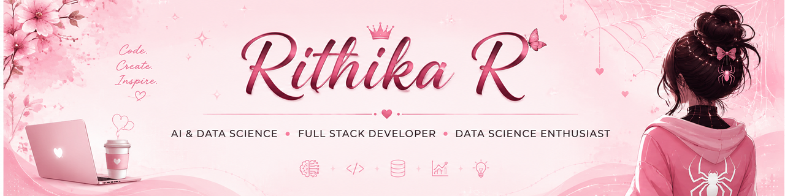

<h1 align="center">
  Hey there, I'm Rithika 👋
</h1>

<h2 align="center">👩‍💻 About Me</h2>

<table align="center">
<tr>

<td width="65%" valign="top">

- 🎓 3rd Year B.Tech Artificial Intelligence & Data Science student.
- 💻 AI & Data Science enthusiast passionate about building modern web applications.
- 🚀 Aspiring Full Stack Developer building AI-powered and real-world projects.
- 🌱 Currently learning Data Science, Full Stack Development, SQL, Power BI & Excel.
- 🎯 Goal: Build products that solve real-world problems.
- 🎨 Passionate about AI, Data Science, Art, Painting, and creating meaningful things.
- ✨ Always exploring new ideas, technologies, and opportunities to grow.

</td>

<td width="35%" align="center" valign="middle">

</td>

</tr>
</table>

<h2 align="center">🛠️ Tech Stack</h2>

<h2 align="center">🚀 Featured Project</h2>

A web-based healthcare management system designed to streamline patient care and connect patients, doctors, nurses, and administrators through a centralized platform.

<h2 align="center">📊 Data & Analytics</h2>

<h2 align="center">📈 GitHub Analytics</h2>

<h2 align="center">🐍 Contribution Graph</h2>

<picture>
  <source media="(prefers-color-scheme: dark)"
          srcset="https://raw.githubusercontent.com/Rithikaraju/Rithikaraju/output/github-snake-dark.svg">

  <source media="(prefers-color-scheme: light)"
          srcset="https://raw.githubusercontent.com/Rithikaraju/Rithikaraju/output/github-snake.svg">

  

</picture>

<h2 align="center">🌐 Let's Connect</h2>

  <strong style="color:#E75480;">Keep Learning • Keep Building • Keep Growing 🚀</strong>

